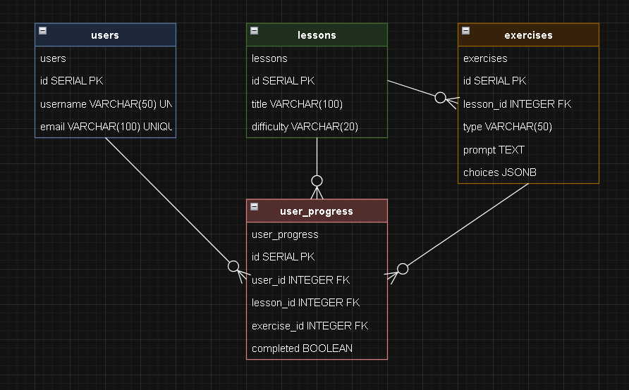

# Aplicativo de Aprendizado de Coreano

## Visão Geral
Este aplicativo ajuda os usuários a aprenderem coreano através de lições e exercícios interativos. Possui autenticação de usuários, acompanhamento de progresso nas lições e design responsivo para todos os dispositivos.

## Estrutura do Projeto
```
├── assets/           # Arquivos estáticos (imagens, fontes, etc.)
├── config/          # Configurações do projeto
├── controllers/     # Controladores da aplicação
├── documentos/      # Documentação do projeto
│   ├── db_schema.drawio  # Diagrama editável do banco de dados
│   ├── db_diagram.png    # Imagem do diagrama do banco de dados
│   └── schema.sql        # Script SQL do banco de dados
├── frontend/        # Código do frontend
├── lib/            # Bibliotecas e utilitários
├── middleware/     # Middlewares do Express
├── models/         # Modelos do banco de dados
├── routes/         # Rotas da aplicação
├── scripts/        # Scripts utilitários
├── services/       # Serviços da aplicação
├── tests/          # Testes automatizados
├── views/          # Templates EJS
├── .env            # Variáveis de ambiente
├── package.json    # Dependências e scripts
└── server.js       # Ponto de entrada da aplicação
```

## Modelo do Banco de Dados
O banco de dados utiliza PostgreSQL e possui quatro tabelas principais:

### Tabela de Usuários
- `id`: UUID (Chave Primária)
- `username`: VARCHAR(255) (Único)
- `email`: VARCHAR(255) (Único)
- `password_hash`: VARCHAR(255)
- `role`: VARCHAR(50) ('user' ou 'admin')
- `created_at`: TIMESTAMP
- `updated_at`: TIMESTAMP

### Tabela de Lições
- `id`: UUID (Chave Primária)
- `title`: VARCHAR(255)
- `description`: TEXT
- `order_index`: INTEGER
- `created_at`: TIMESTAMP
- `updated_at`: TIMESTAMP

### Tabela de Exercícios
- `id`: UUID (Chave Primária)
- `lesson_id`: UUID (Chave Estrangeira)
- `type`: VARCHAR(50)
- `difficulty`: VARCHAR(20)
- `prompt`: TEXT
- `choices`: JSONB
- `correct_answer`: TEXT
- `explanation`: TEXT
- `order_index`: INTEGER
- `created_at`: TIMESTAMP
- `updated_at`: TIMESTAMP

### Tabela de Progresso do Usuário
- `id`: UUID (Chave Primária)
- `user_id`: UUID (Chave Estrangeira)
- `lesson_id`: UUID (Chave Estrangeira)
- `exercise_id`: UUID (Chave Estrangeira)
- `completed`: BOOLEAN
- `correct`: BOOLEAN
- `attempts`: INTEGER
- `last_attempt_at`: TIMESTAMP
- `created_at`: TIMESTAMP
- `updated_at`: TIMESTAMP



## Requisitos
- Node.js 14.x ou superior
- PostgreSQL 12.x ou superior
- NPM ou Yarn
- Conta Supabase

## Configuração do Ambiente
1. Clone o repositório:
```bash
git clone [URL_DO_REPOSITÓRIO]
cd korean-learning-app
```

2. Instale as dependências:
```bash
# Instalar dependências do backend
npm install

# Instalar dependências do frontend
cd frontend
npm install
```

3. Configure as variáveis de ambiente:
Crie um arquivo `.env` na raiz do projeto:
```env
# Servidor
PORT=3000
JWT_SECRET=sua-chave-secreta
SESSION_SECRET=sua-chave-de-sessao

# Banco de Dados
DATABASE_URL=sua-string-de-conexao-supabase

# Frontend
VITE_API_URL=http://localhost:3000/api
```

4. Configure o banco de dados:
```bash
node scripts/reset-db.js
```
Este script irá:
- Criar todas as tabelas necessárias
- Configurar os relacionamentos
- Criar usuários de teste (admin/test)

## Executando o Projeto
1. Inicie o servidor em modo desenvolvimento:
```bash
# Iniciar servidor backend (da raiz do projeto)
npm run dev

# Iniciar servidor frontend (do diretório frontend)
cd frontend
npm run dev
```

## Endpoints da API

### Autenticação
- `POST /api/auth/login` - Login do usuário
- `POST /api/auth/logout` - Logout do usuário
- `GET /api/auth/me` - Obter usuário atual

### Acompanhamento de Progresso
- `GET /api/auth/progress` - Obter progresso do usuário
- `POST /api/auth/progress` - Atualizar progresso
- `GET /api/auth/progress/lesson/:lessonId` - Obter progresso da lição

### Lições
- `GET /api/lessons` - Obter todas as lições
- `GET /api/lessons/:id` - Obter lição por ID

### Exercícios
- `GET /api/exercises` - Obter todos os exercícios
- `GET /api/exercises/:id` - Obter exercício por ID

## Usuários de Teste

O script de inicialização do banco de dados cria dois usuários de teste:

1. Usuário Admin:
   - Usuário: admin
   - Senha: admin
   - Função: admin

2. Usuário Teste:
   - Usuário: test
   - Senha: test123
   - Função: user

## Melhorias Recentes
- **Correções de Bugs:**
  - Corrigida navegação e passagem de parâmetros para exercícios
  - Resolvidos avisos de chaves React nas listas de exercícios
  - Melhorado tratamento de erros para parâmetros ausentes ou inválidos
  - Adicionadas mensagens de erro robustas
  - Removido o wrapper Layout duplicado em LessonsPage para evitar renderização recursiva
  - Corrigido o redirecionamento catch-all para a tela inicial
  - Garantido que cada lição possui um array de exercícios, evitando erros de renderização
  - Adicionados logs para depuração dos dados recebidos da API
  - Ajustada a navegação para evitar loops de renderização ao clicar em 'Lições' no cabeçalho

## Suporte a Dispositivos Móveis
- O aplicativo é totalmente responsivo
- Páginas de exercícios e lições se adaptam a diferentes tamanhos de tela
- Fontes e espaçamentos são ajustados automaticamente

## Solução de Problemas
- Se encontrar erro 404 ou /undefined na URL ao navegar para um exercício, verifique se `exercise.exercise_id` está sendo usado corretamente
- Se houver avisos de chave React, verifique se a prop key está definida como `exercise.exercise_id`
- Para erros de parâmetros ausentes, verifique se as rotas e uso de useParams correspondem à estrutura esperada

## Licença
MIT
